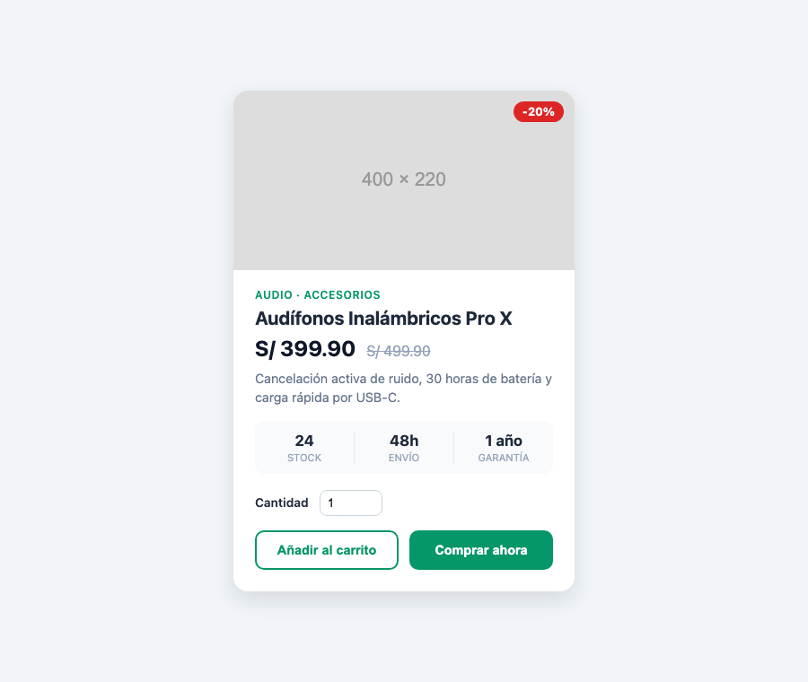
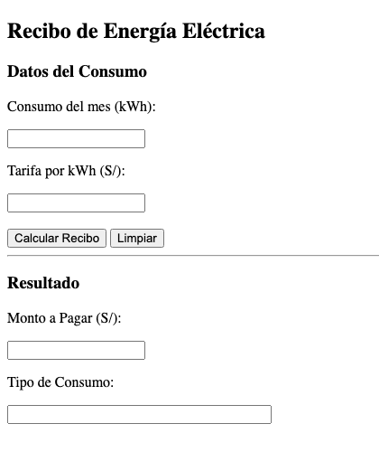
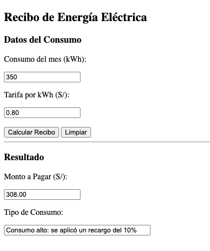

# Ejercicios de preparación Examen Escrito 1

## Requerimientos

Deben de tener configurado su proyecto para utilizar tailwind de la forma rápida. En este caso, se le está proporcionando los estilos tailwind de forma local, por lo que no debe utilizar la dirección externa de tailwind.

En su documento HTML, tenerlo importado:

```html
<script src="/tailwind.css"></script>
```

> [!NOTE]
> No olvidarse de crear el archivo `tailwind.config.js` para que la extensión de VSCode pueda darles las funcionalidades de ayuda.
 
---

## Ejercicio 1

Debes implementar una tarjeta de perfil de usuario profesional para una red social corporativa. El archivo debe entregarse con el nombre perfil.html. Puedes utilizar CSS puro o Tailwind CSS. El archivo que deben de crear debe de llamarse pregunta1.html (y si utiliza CSS puro, pregunta1.css).

### Requerimientos de Diseño

1. Layout General:
    - La tarjeta debe estar perfectamente centrada tanto horizontal como verticalmente en el viewport.
    - El fondo de la página debe tener un color gris claro para que la tarjeta resalte.
2. El Contenedor de la Tarjeta:
    - Estilos: Bordes redondeados pronunciados, fondo blanco y una sombra suave (box-shadow) que dé sensación de elevación. Además los bordes pueden tener un gris oscuro.
3. Cabecera Visual:
    - Debe incluir una imagen de portada que se le envía. Esta debe de estar centrada.
4. Sección de Información:
    - Debe mostrar el nombre del usuario (en negrita) y su cargo actual (en un tono grisáceo).
    - Incluir una breve descripción biográfica centrada.
5. Sección de Estadísticas (Uso de Flexbox):
    - Crear una fila con tres columnas que muestren: Seguidores, Proyectos y Valoración.
    - Cada columna debe tener el número en grande y la etiqueta debajo.
6. Botones de Acción:
    - Incluir dos botones: "Mensaje" (estilo secundario) y "Seguir" (estilo llamativo/primario).
    - Al pasar el ratón (hover), los botones deben cambiar ligeramente de tono o escala.
    - Para la imagen, utilizar el placeholder que se llama `pregunta1.svg` que se encuentra dentro de la carpeta imagenes.


### Rúbrica

| Criterio | Descripción |
| -------- | ----------- |
| Estructura HTML | Uso correcto de etiquetas html (form, label, input, button, img) y jerarquía adecuada del contenido. |
| Maquetación | Centrado perfecto y uso eficiente de Flexbox/Grid. |
| Estética y CSS | Aplica sombras, bordes y espaciados (padding) profesionales. |
| Interactividad | Incluye estados :hover en botones y transiciones suaves. |

## Ejercicio 2

Crear una herramienta que calcule el costo de un pedido utilizando cajas de texto tanto para el ingreso como para la visualización de resultados. Los archivos que deben de crear debe de llamarse pregunta2.html y pregunta2.js.

### Requerimientos:

1. Entradas: Dos campos con sus respectivos títulos: "Precio unitario" y "Cantidad comprada".
2. Acciones: * Botón "Procesar": Realiza el cálculo.
    - Botón "Limpiar": Restablece todos los campos.
3. Salidas: Dos campos de texto para "Total a Pagar" y "Estado de la Operación". Estos campos deben ser de solo lectura.
4. Lógica: Aplicar un descuento del 15% si el total supera los $200.
5. Restricción Técnica: Toda interacción debe ser mediante .value.

 

### Rúbrica

| Criterio | Descripción |
| -------- | ----------- |
| Estructura HTML y orden del documento | Utiliza correctamente etiquetas de título (h2, h3) e inputs con sus respectivos IDs únicos y descriptivos. |
| Manejo de Eventos | Implementa el evento onclick en los botones llamando a las funciones correspondientes de forma exacta. |
| Lógica y JS (Lectura) | Captura los datos de los inputs usando .value y realiza el parseo de datos (parseFloat/parseInt) correctamente. |
| Lógica y JS (Escritura) | Muestra los resultados y mensajes exclusivamente a través del atributo .value en inputs. |
| Reglas de Negocio | La validación de campos vacíos y el cálculo del descuento (15%) funcionan perfectamente según las condiciones. |


## Ejercicio 3

Debes implementar una tarjeta de producto para una tienda en línea de tecnología. Puedes utilizar CSS puro o Tailwind CSS. El archivo que deben de crear debe de llamarse pregunta3.html (y si utiliza CSS puro, pregunta3.css).

### Requerimientos de Diseño

1. Layout General:
    - La tarjeta debe estar perfectamente centrada tanto horizontal como verticalmente en el viewport.
    - El fondo de la página debe tener un color gris azulado muy claro para que la tarjeta resalte.
2. El Contenedor de la Tarjeta:
    - Estilos: Ancho fijo (aprox. 380px), bordes redondeados, fondo blanco y una sombra suave (box-shadow) que dé sensación de elevación.
    - La imagen no debe sobresalir de las esquinas redondeadas de la tarjeta.
3. Imagen del Producto:
    - Debe ocupar todo el ancho de la tarjeta en la parte superior.
    - Sobre la esquina superior derecha de la imagen debe mostrarse una etiqueta de descuento ("-20%") con fondo rojo, texto blanco y forma de píldora (usar posicionamiento `position: relative` / `absolute`).
    - Para la imagen, utilizar el placeholder que se llama `pregunta3.svg` que se encuentra dentro de la carpeta imagenes.
4. Sección de Información:
    - Mostrar la categoría del producto en mayúsculas, en un tamaño pequeño y con el color principal de la tarjeta (verde).
    - Mostrar el nombre del producto (en negrita).
    - Mostrar el precio actual en grande y, a su lado, el precio anterior tachado y en tono grisáceo.
    - Incluir una breve descripción del producto en tono grisáceo.
5. Sección de Detalles (Uso de Flexbox):
    - Crear una fila con tres columnas que muestren: Stock, Envío y Garantía.
    - Cada columna debe tener el valor en negrita y la etiqueta debajo, en mayúsculas y más pequeña.
    - Las columnas deben estar separadas por una línea vertical delgada y la fila debe tener un fondo ligeramente distinto al de la tarjeta.
6. Formulario de Compra:
    - Incluir un campo numérico "Cantidad" con su respectiva etiqueta (`label`) asociada al `input`. El valor mínimo debe ser 1.
    - Incluir dos botones del mismo ancho: "Añadir al carrito" (estilo secundario: fondo blanco con borde del color principal) y "Comprar ahora" (estilo primario: fondo del color principal y texto blanco).
    - Al pasar el ratón (hover), los botones deben cambiar ligeramente de tono y escala con una transición suave.



### Rúbrica

| Criterio | Descripción |
| -------- | ----------- |
| Estructura HTML | Uso correcto de etiquetas html (article, img, h2, del, ul/li, form, label, input, button) y jerarquía adecuada del contenido. |
| Maquetación | Centrado perfecto, uso eficiente de Flexbox/Grid y posicionamiento correcto de la etiqueta de descuento sobre la imagen. |
| Estética y CSS | Aplica sombras, bordes redondeados, espaciados (padding) y una paleta de colores coherente. |
| Interactividad | Incluye estados :hover en botones y transiciones suaves. |

## Ejercicio 4

Crear una herramienta que calcule el monto a pagar de un recibo de luz utilizando cajas de texto tanto para el ingreso como para la visualización de resultados. Los archivos que deben de crear debe de llamarse pregunta4.html y pregunta4.js.

### Requerimientos:

1. Entradas: Dos campos con sus respectivos títulos: "Consumo del mes (kWh)" y "Tarifa por kWh (S/)".
2. Acciones:
    - Botón "Calcular Recibo": Realiza el cálculo.
    - Botón "Limpiar": Restablece todos los campos.
3. Salidas: Dos campos de texto para "Monto a Pagar (S/)" y "Tipo de Consumo". Estos campos deben ser de solo lectura.
4. Lógica:
    - Monto = consumo × tarifa. El consumo es un número entero (usar `parseInt`) y la tarifa un número decimal (usar `parseFloat`).
    - Si el consumo supera los 300 kWh, aplicar un **recargo** del 10% sobre el monto y mostrar en "Tipo de Consumo" el mensaje "Consumo alto: se aplicó un recargo del 10%". En caso contrario, mostrar "Consumo normal: sin recargo".
    - El monto debe mostrarse con 2 decimales.
5. Validaciones:
    - Si algún campo de entrada está vacío, mostrar en "Tipo de Consumo" el mensaje "Error: complete todos los campos" y dejar vacío el monto.
    - Si algún valor no es numérico o es menor o igual a 0, mostrar "Error: ingrese valores numéricos mayores a 0" y dejar vacío el monto.
6. Restricción Técnica: Toda interacción debe ser mediante .value.

 

### Rúbrica

| Criterio | Descripción |
| -------- | ----------- |
| Estructura HTML y orden del documento | Utiliza correctamente etiquetas de título (h2, h3) e inputs con sus respectivos IDs únicos y descriptivos. |
| Manejo de Eventos | Implementa el evento onclick en los botones llamando a las funciones correspondientes de forma exacta. |
| Lógica y JS (Lectura) | Captura los datos de los inputs usando .value y realiza el parseo de datos (parseInt para el consumo y parseFloat para la tarifa) correctamente. |
| Lógica y JS (Escritura) | Muestra los resultados y mensajes exclusivamente a través del atributo .value en inputs. |
| Reglas de Negocio | Las validaciones (campos vacíos y valores no válidos) y el cálculo del recargo (10%) funcionan perfectamente según las condiciones. |
