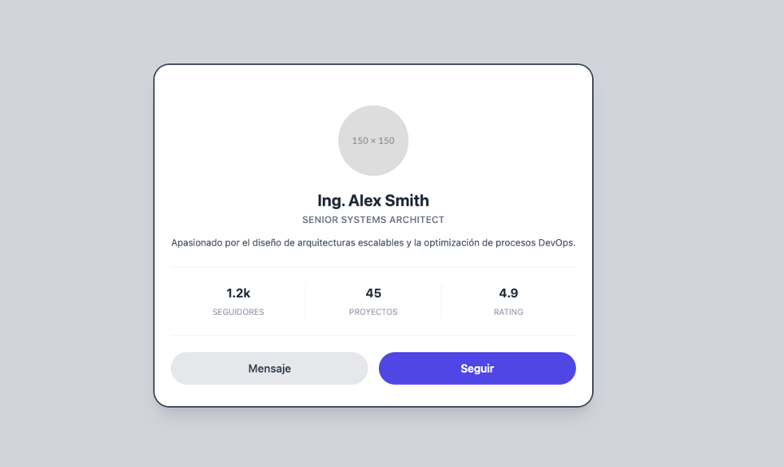
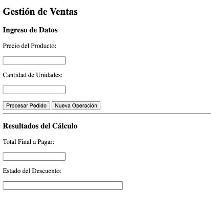
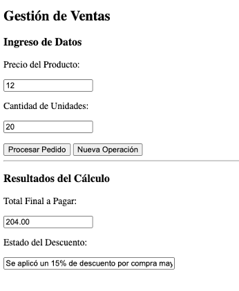

# Ejercicios de preparación Examen Escrito 1

## Requerimientos

Deben de tener configurado su proyecto para utilizar tailwind de la forma rápida. En este caso, se le está proporcionando los estilos tailwind de forma local, por lo que no debe utilizar la dirección externa de tailwind.

En su documento HTML, tenerlo importado:

```html
<script src="/tailwind.css"></script>
```

> [!NOTE]
> No olvidarse de crear el archivo `tailwind.config.js` para que la extensión de VSCode pueda darles las funcionalidades de ayuda.
 
---

## Ejercicio 1

Debes implementar una tarjeta de perfil de usuario profesional para una red social corporativa. El archivo debe entregarse con el nombre perfil.html. Puedes utilizar CSS puro o Tailwind CSS. El archivo que deben de crear debe de llamarse pregunta1.html (y si utiliza CSS puro, pregunta1.css).

### Requerimientos de Diseño

1. Layout General:
    - La tarjeta debe estar perfectamente centrada tanto horizontal como verticalmente en el viewport.
    - El fondo de la página debe tener un color gris claro para que la tarjeta resalte.
2. El Contenedor de la Tarjeta:
    - Estilos: Bordes redondeados pronunciados, fondo blanco y una sombra suave (box-shadow) que dé sensación de elevación. Además los bordes pueden tener un gris oscuro.
3. Cabecera Visual:
    - Debe incluir una imagen de portada que se le envía. Esta debe de estar centrada.
4. Sección de Información:
    - Debe mostrar el nombre del usuario (en negrita) y su cargo actual (en un tono grisáceo).
    - Incluir una breve descripción biográfica centrada.
5. Sección de Estadísticas (Uso de Flexbox):
    - Crear una fila con tres columnas que muestren: Seguidores, Proyectos y Valoración.
    - Cada columna debe tener el número en grande y la etiqueta debajo.
6. Botones de Acción:
    - Incluir dos botones: "Mensaje" (estilo secundario) y "Seguir" (estilo llamativo/primario).
    - Al pasar el ratón (hover), los botones deben cambiar ligeramente de tono o escala.
    - Para la imagen, utilizar el placeholder que se llama `pregunta1.svg` que se encuentra dentro de la carpeta imagenes.




### Rúbrica

| Criterio | Descripción |
| -------- | ----------- |
| Estructura HTML | Uso correcto de etiquetas html (form, label, input, button, img) y jerarquía adecuada del contenido. |
| Maquetación | Centrado perfecto y uso eficiente de Flexbox/Grid. |
| Estética y CSS | Aplica sombras, bordes y espaciados (padding) profesionales. |
| Interactividad | Incluye estados :hover en botones y transiciones suaves. |

## Ejercicio 2

Crear una herramienta que calcule el costo de un pedido utilizando cajas de texto tanto para el ingreso como para la visualización de resultados. Los archivos que deben de crear debe de llamarse pregunta2.html y pregunta2.js.

### Requerimientos:

1. Entradas: Dos campos con sus respectivos títulos: "Precio unitario" y "Cantidad comprada".
2. Acciones: * Botón "Procesar": Realiza el cálculo.
    - Botón "Limpiar": Restablece todos los campos.
3. Salidas: Dos campos de texto para "Total a Pagar" y "Estado de la Operación". Estos campos deben ser de solo lectura.
4. Lógica: Aplicar un descuento del 15% si el total supera los $200.
5. Restricción Técnica: Toda interacción debe ser mediante .value.

 

### Rúbrica

| Criterio | Descripción |
| -------- | ----------- |
| Estructura HTML y orden del documento | Utiliza correctamente etiquetas de título (h2, h3) e inputs con sus respectivos IDs únicos y descriptivos. |
| Manejo de Eventos | Implementa el evento onclick en los botones llamando a las funciones correspondientes de forma exacta. |
| Lógica y JS (Lectura) | Captura los datos de los inputs usando .value y realiza el parseo de datos (parseFloat/parseInt) correctamente. |
| Lógica y JS (Escritura) | Muestra los resultados y mensajes exclusivamente a través del atributo .value en inputs. |
| Reglas de Negocio | La validación de campos vacíos y el cálculo del descuento (15%) funcionan perfectamente según las condiciones. |


